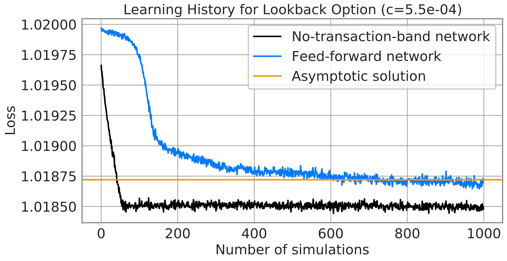
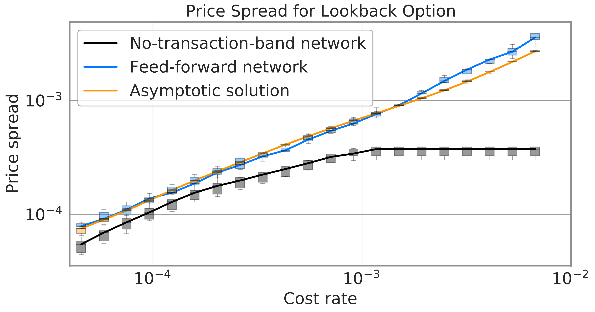
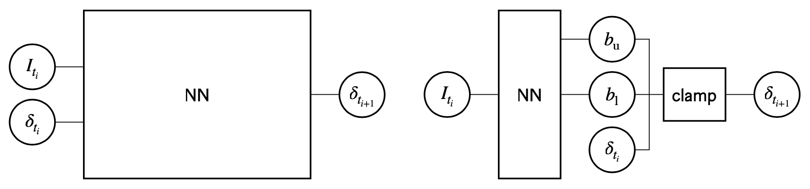

<h1 align="center">No-Transaction Band Network:   A Neural Network Architecture for Efficient Deep Hedging</h1>

[][colab-notebook]

Minimal implementation and experiments of "[*No-Transaction Band Network: A Neural Network Architecture for Efficient Deep Hedging*][ntb-network-arxiv]".

Hedging and pricing financial derivatives while taking into account transaction costs is a tough task.
Since the hedging optimization is computationally expensive or even inaccessible, risk premiums of derivatives are often overpriced.
This problem prevents the liquid offering of financial derivatives.

Our proposal, "*No-Transaction Band Network*", enables precise hedging with much fewer simulations.
This improvement leads to the offering of cheaper risk premiums and thus liquidizes the derivative market.
We believe that our proposal brings the data-driven derivative business via "*[Deep Hedging][deep-hedging-arxiv]*" much closer to practical applications.

## Summary

* [Deep Hedging][deep-hedging-arxiv] is a deep learning-based framework to hedge financial derivatives.
* However, a hedging strategy is hard to train due to the action dependence, *i.e.*, an appropriate hedging action at the next step depends on the current action.
* We propose a "*No-Transaction Band Network*" to overcome this issue.
* This network circumvents the action-dependence and facilitates quick and precise hedging.

## Motivation and Result

Hedging financial derivatives ([exotic options](https://en.wikipedia.org/wiki/Exotic_option) in particular) in the presence of transaction cost is a hard task.

In the absence of transaction cost, the perfect hedge is accessible based on the [Black-Scholes model](https://en.wikipedia.org/wiki/Black%E2%80%93Scholes_model).
The real market, in contrast, always involves transaction cost and thereby makes hedging optimization much more challenging.
Since the analytic formulas (such as the [Black-Scholes formula of European option](https://en.wikipedia.org/wiki/Black%E2%80%93Scholes_model#Black%E2%80%93Scholes_formula)) are no longer available in such a market, human traders may hedge and then price derivatives based on their experiences.

[Deep Hedging][deep-hedging-arxiv] is a ground-breaking framework to automate and optimize such operations.
In this framework, a neural network is trained to hedge derivatives so that it minimizes a proper risk measure.
However, training in deep hedging suffers difficulty of action dependence since an appropriate action at the next step depends on the current action.

So, we propose "*No-Transaction Band Network*" for efficient deep hedging.
This architecture circumvents the complication to facilitate quick training and better hedging.

The learning histories above demonstrate that the no-transaction band network can be trained much quicker than the ordinary feed-forward network (See our paper for details).

The figure above plots the derivative price (technically derivative price spreads, which are prices subtracted by that without transaction cost) as a function of the transaction cost.
The no-transaction-band network attains cheaper prices than the ordinary network and an approximate analytic formula.

## Proposed Architecture: No-Transaction Band Network

The following figures show the schematic diagrams of the neural network which was originally proposed in [Deep Hedging][deep-hedging-arxiv] (left) and the [no-transaction band network][ntb-network-arxiv] (right).

* **The original network**:
  - The input of the neural network uses the current hedge ratio (`δ_ti`) as well as other information (`I_ti`).
  - Since the input includes the current action `δ_ti`, this network suffers the complication of action-dependence.
* **The no-transaction band network**:
  - This architecture computes "no-transaction band" `[b_l, b_u]` by a neural network and then gets the next hedge ratio by [`clamp`](https://pytorch.org/docs/stable/generated/torch.clamp.html)ing the current hedge ratio inside this band.
  - Since the input of the neural network does not use the current action, this architecture can circumvent the action-dependence and facilitate training.

## Give it a Try!

[][colab-notebook]

You can try out the efficacy of *No-Transaction Band Network* on a Jupyter Notebook: [`main.ipynb`](main.ipynb).

As you can see there, the no-transaction-band can be implemented by simply adding one special layer to an arbitrary neural network.

A comprehensive library for Deep Hedging, [`pfhedge`](https://github.com/pfnet-research/pfhedge), is available on PyPI.

## References

* Shota Imaki, Kentaro Imajo, Katsuya Ito, Kentaro Minami and Kei Nakagawa, "No-Transaction Band Network: A Neural Network Architecture for Efficient Deep Hedging". arXiv:[2103.01775][ntb-network-arxiv] \[q-fin.CP\].
* 今木翔太, 今城健太郎, 伊藤克哉, 南賢太郎, 中川慧, "[効率的な Deep Hedging のためのニューラルネットワーク構造](https://sigfin.org/026-15/)", 人工知能学 金融情報学研究会（SIG-FIN）第 26 回研究会.
* Hans Bühler, Lukas Gonon, Josef Teichmann and Ben Wood, "[Deep hedging][deep-hedging-qf]". Quantitative Finance, 2019, 19, 1271–1291. arXiv:[1609.05213][deep-hedging-arxiv] [q-fin.CP].

[deep-hedging-arxiv]: https://arxiv.org/abs/1802.03042
[deep-hedging-qf]: https://doi.org/10.1080/14697688.2019.1571683
[ntb-network-arxiv]: https://arxiv.org/abs/2103.01775
[colab-notebook]: https://colab.research.google.com/github/pfnet-research/NoTransactionBandNetwork/blob/main/main.ipynb
